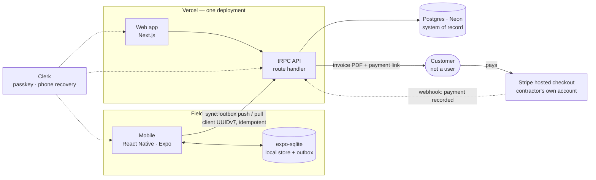

# Overview

Orientation for anyone evaluating this project — a collaborator, a reviewer, or a future
maintainer. **Start here, then follow the reading path.**

This file owns orientation only: how the pieces fit, where things live, and what to read in
what order. It points rather than restates.

## What TRADER is

Phone-first daily closeout and job costing for painting contractors. Field activity — labor,
materials, job progress — is captured on the phone at the end of each workday, offline if
necessary, so the office has a usable record for payroll, job costing and billing.

The governing constraint is that **the field client must work with no signal.** A foreman in
a basement clocks in, switches jobs, logs materials and closes out; it syncs hours later
without loss or duplication. Everything in the architecture follows from that.

## The system at a glance

The customer is drawn because v1 takes their money, but note what the arrows do **not** show:
funds never pass through TRADER, and no card data reaches it. The customer has no account — a
payment link is the whole relationship.

[SPEC.md](SPEC.md) §1–§2 own this architecture; the diagram depicts it, and §2 is the
complete stack. Deliberately not drawn — peripheral to the request, sync and payment paths
shown here — are observability, file storage, background jobs, secrets and worker notifications.

Four pieces we build and run, one deploy target. The web app and the API ship as a single Vercel deployment;
both clients call the same typed tRPC router, so a signature change breaks compilation on
both rather than failing at runtime.

The server is authoritative. Clients never argue with it — they send append-only events
stamped with client-generated UUIDv7s, the server upserts idempotently, and losing devices
snap to server truth on the next sync.

## What exists today

`packages/db` — the Postgres schema, migrations, the triggers enforcing append-only labor — and
`packages/api`, the tRPC router with just-in-time provisioning, role gates and the sync boundary.
Both applications exist: `apps/web` hosts the API and signs an admin in, `apps/mobile` clocks a
worker in and out **offline**, holding events in an `expo-sqlite` outbox until they sync.

The sync layer — the largest single risk — now runs end to end: idempotent push, the shared session
fold, the pull cursor, the device outbox, and sync on foreground, reconnect and a timer. A device
snaps to server truth without anyone tapping anything.

Clock actions are attested with the device's own biometrics, and the level reaches Postgres on the
event — the biometric template never leaves the phone.

Still unbuilt: passkey sign-in (`AUTH-1`–`AUTH-10`), which needs a Clerk account and a physical
device; and the correction path an admin needs, which is Phase 3.

Current status and what each phase is gated on → [ROADMAP.md](ROADMAP.md). Open decisions →
[DECISIONS.md](DECISIONS.md).

## Repository map

| Path            | What it is                                                                                                  |
| --------------- | ----------------------------------------------------------------------------------------------------------- |
| `packages/db/`  | Schema, migrations, seed, invariant tests. Has its own [README](../packages/db/README.md)                   |
| `packages/api/` | tRPC routers, request context, role gates. Exports `AppRouter` — the contract both clients import as a type |
| `apps/web/`     | Next.js — the office app, and the route handler that hosts the tRPC API both clients call                   |
| `apps/mobile/`  | Expo — the field app. Owns the device SQLite store and the outbox                                           |
| `docs/`         | The documents in the reading path below                                                                     |
| `CLAUDE.md`     | The one-fact-one-home rule this repository is maintained under                                              |

## Reading path

1. **This file** — orientation.
2. **[SPEC.md](SPEC.md)** — what the system is. Read §3 (offline and sync) and §4 (data
   model) closely; they carry the design.
3. **[LOGIC.md](LOGIC.md)** — the numbered rules the system must obey. Read this before
   writing behaviour; each rule has a permanent identifier that code and tests cite. **CAPTURE**
   and **STORE** come first for a reason: they say when a labor event may be written and what
   must remain true of it afterwards, and everything else assumes both.
4. **[ROADMAP.md](ROADMAP.md)** — where it is going, what is done, and what each phase is
   gated on.
5. **[DECISIONS.md](DECISIONS.md)** — why. Read this before proposing a change; most obvious
   suggestions have already been considered and recorded, including the ones that were
   reversed.
6. **[packages/db/README.md](../packages/db/README.md)** — how to run it locally.

[WORKFLOW.md](WORKFLOW.md) and [ACCOUNTS.md](ACCOUNTS.md) are operational — machine setup and
external services. Skip them until you need to run or deploy something.

## Invariants you must not break

Four things are enforced mechanically rather than by convention. Each is tested against a real
database; if a test fails, the change is wrong, not the test. They are stated as rules in
[LOGIC.md](LOGIC.md)'s **STORE** group — cite those identifiers rather than this table.

| Invariant                                                                                                                                     | Rule    | Enforced in                                                                                                   |
| --------------------------------------------------------------------------------------------------------------------------------------------- | ------- | ------------------------------------------------------------------------------------------------------------- |
| **Labor history is immutable.** `work_session_events` rejects UPDATE, DELETE and TRUNCATE — including for admins. Corrections are new events. | STORE-1 | `packages/db/migrations/0001_append_only_guard.sql`, asserted in `packages/db/test/schema-invariants.test.ts` |
| **Money is integer cents, never floating point.**                                                                                             | STORE-2 | `packages/db/test/schema-invariants.test.ts`                                                                  |
| **Every tenant-scoped table carries a non-nullable `company_id`** — the seam multi-tenancy attaches to later.                                 | STORE-3 | `packages/db/test/schema-invariants.test.ts`                                                                  |
| **`server_timestamp` is millisecond precision.** The sync cursor keys on it; at finer precision pagination livelocks while looking healthy.   | STORE-4 | `packages/db/test/schema-invariants.test.ts` (two assertions)                                                 |

The reasoning for all four is in [DECISIONS.md](DECISIONS.md).
